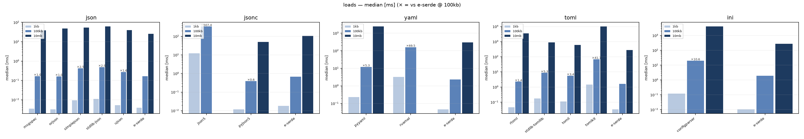

<p align="center">
  
</p>

<p align="center">
  <a href="https://github.com/damvolkov/e-serde/actions/workflows/ci.yml"></a>
  <a href="https://pypi.org/project/e-serde/"></a>
  <a href="https://pypi.org/project/e-serde/"></a>
  <a href="LICENSE"></a>
</p>

Universal structured-data loader: native **Rust** codecs that decode any popular config
format into native Python objects — and, when you ask, into frozen `msgspec` models.
Two verbs, `loads`/`dumps`, sync and async twins, one wheel. `json`-module semantics,
strict typing, no surprises.

Part of the **Eager** (`e-`) stack by [damvolkov](https://github.com/damvolkov), built on
open-source engines — the speed and robustness of C and Rust, for serialization in Python.

## Install

```bash
uv add e-serde          # or: pip install e-serde
```

## Usage

```python
import eserde
import msgspec
from eserde import Format
from pathlib import Path
```

Six functions, `json` semantics, keyword-only options. Files are named by `Path` or
plain string path and inferred from the suffix (`.json .jsonc .yaml .yml .toml .ini .cfg
.conf .csv .tsv`); `format=` accepts a `Format` member or its name (`"json"`); pure JSON
content sniffs itself, and everything else must declare its format.

| Function | Input | Output |
| --- | --- | --- |
| `loads` | `bytes \| str \| Path` | plain tree — or the model in `type=` |
| `dumps` | any object | `bytes` |
| `load` | `str \| Path \| BinaryIO` | like `loads` |
| `dump` | object → file | `None` |
| `aloads` · `adumps` · `aload` · `adump` | same | awaitables of the same |

### loads — decode

```python
cfg = eserde.loads(b'{"host": "0.0.0.0", "port": 8080}', format=Format.JSON)
# {'host': '0.0.0.0', 'port': 8080}
```

```python
class Server(msgspec.Struct, frozen=True):
    host: str
    port: int


srv = eserde.loads(src, format=Format.JSON, type=Server)  # Server(host='0.0.0.0', port=8080)
srv = eserde.loads(ini, format=Format.INI, type=Server, strict=False)  # "8080" → 8080
net = eserde.loads(src, type=Net, dec_hook=lambda t, v: t(v))  # custom fields inside type=
```

| kwarg | effect |
| --- | --- |
| `format=` | a `Format` member or its name; inferred from a path, sniffed from pure JSON, required otherwise |
| `type=` | validate into a Struct, dataclass, TypedDict, attrs or pydantic model; violations raise `LoadError` |
| `strict=False` | msgspec coercion — the escape hatch INI needs |
| `object_hook=` | rewrite every decoded mapping, innermost first (json semantics) |
| `dec_hook=` | teach `type=` custom field types (requires `type=`) |
| `registry=` | swap the default codec set |
| `embed=` | inline `source:`-style references to plain `.md` files, root-confined |

### dumps — encode

```python
raw = eserde.dumps({"name": "demian", "n": 42}, format=Format.YAML)
# b'name: demian\n"n": 42\n'
```

```python
from fractions import Fraction

eserde.dumps({"f": Fraction(1, 2)}, format=Format.JSON, encoders={Fraction: str})  # b'{"f":"1/2"}'
eserde.dumps({"f": Fraction(1, 2)}, format=Format.JSON, default=float)  # b'{"f":0.5}'
```

Every input is normalized through the Jsonable encoder first (datetime → ISO,
`Enum` → value, `bytes` → base64), so each format sees the same tree.

| kwarg | effect |
| --- | --- |
| `format=` | defaults to `Format.JSON` |
| `encoders=` | exact-type hooks, ahead of every built-in; results are re-walked |
| `default=` | json/orjson-style last resort for unknown types; none → `EncoderError` |
| `registry=` | swap the default codec set |
| `embed=` | inline `source:`-style references to plain `.md` files, root-confined |

### load / dump — files

```python
cfg = eserde.load(Path("config.toml"))  # format from the .toml suffix

with open("app.json", "rb") as fh:
    data = eserde.load(fh, format=Format.JSON)  # an open handle needs the format

eserde.dump(cfg, Path("out.jsonc"))  # writes straight to disk → None
```

Same kwargs as `loads` / `dumps`.

### async

`aloads` · `adumps` · `aload` · `adump` — same signatures; I/O and the GIL-free native
parse run off the event loop. The Rust codecs release the GIL, so concurrent `aloads`
parallelizes decode across cores.

```python
async def main():
    srv = await eserde.aloads(Path("config.yaml"), type=Server)
    await eserde.adump(srv, Path("copy.json"))
```

### compat — `json` drop-in

Frameworks duck-type the stdlib module (`json_serialize=`, renderers, formatters).
`eserde.compat` speaks `json.dumps`/`json.loads` exactly, `str` output; behaviours
e-serde cannot share faithfully delegate to the stdlib — slower, never a surprise.

```python
from eserde import compat

compat.dumps({"a": 1}, ensure_ascii=False)  # '{"a":1}'   native compact utf-8
compat.dumps({"a": 1})  # byte-faithful to stdlib json
compat.loads('{"a": 1.5}', parse_float=Decimal)  # delegated to stdlib, never guessed
```

Errors are the `LoaderError` family: `FormatError` (no/unknown format), `LoadError`
(decode or validation), `DumpError` / `EncoderError` (encode), `CodecError` (backend
missing). The full guide lives at [damvolkov.github.io/e-serde](https://damvolkov.github.io/e-serde/).

## Formats and backends

| Format | Extension             | Spec                       | Engine (pinned)        | Notable                              |
| ------ | --------------------- | -------------------------- | ---------------------- | ------------------------------------ |
| JSON   | `.json`               | RFC 8259                   | `msgspec.json` 0.21    | exact big ints, strict tokens        |
| JSONC  | `.jsonc`              | Deno jsonc                 | `jsonc-parser` 0.33    | comments, trailing commas            |
| YAML   | `.yaml` `.yml`        | YAML 1.2 core + merge keys | `saphyr` 0.0.12        | anchors, `<<`, bomb-guarded          |
| TOML   | `.toml`               | TOML v1.1                  | `toml-rs` 1.1          | `inf`/`nan`, no null, i64 ints       |
| INI    | `.ini` `.cfg` `.conf` | de-facto                   | `rust-ini` 0.21        | strings; merge on `strict=False`     |
| CSV    | `.csv`                | RFC 4180                   | `csv` 1.4              | `list[dict]`, polars-style inference |
| TSV    | `.tsv`                | RFC 4180 (tab)             | `csv` 1.4              | same codec, tab-delimited            |

The contract lives in code — `eserde.STANDARDS` — and `test_standards.py` executes every
claim against the live codecs and the lockfiles. Bumping an engine or changing a format
capability is a deliberate act, never silent drift. Full per-format pages (capabilities,
limits, examples): [docs → Formats](https://damvolkov.github.io/e-serde/formats/).

Everything Rust is one extension module (`eserde._native`), compiled by `maturin` from
`crates/native`. The only runtime dependency is `msgspec`.

## Benchmarks

Median decode of a 100 KB config on CPython 3.14 (release build). Regenerate with `make bench`.



| Format | e-serde | nearest rival | margin |
| --- | --- | --- | --- |
| JSON | 0.17 ms | orjson 0.17 ms | ≈ tie — same decoder (msgspec) |
| YAML | 2.20 ms | pyyaml C 12–16 ms | ≈6× — ruamel 66× |
| TOML | 1.53 ms | rtoml 2.3–2.5 ms | 1.5× — tomlkit 42× |
| JSONC | 0.79 ms | pyjson5 0.39 ms | the one format behind (×0.5) |
| INI | 2.00 ms | configparser 22 ms | 11× |
| CSV | 0.9–1.0 ms | polars 1.3–1.7 ms | ×1.3–1.8 — and polars never releases the GIL; stdlib csv is comparable and untyped |

Because the Rust codecs release the GIL, `aloads` parallelizes decode: on 10 MB YAML/TOML the
async fan-out is ~2× faster than serial sync (JSON stays flat — msgspec's C decoder holds the
GIL). More charts in [`assets/benchmarks/`](assets/benchmarks/):
[dumps](assets/benchmarks/dumps.png) ·
[typed](assets/benchmarks/typed.png) ·
[async](assets/benchmarks/async.png) ·
[memory](assets/benchmarks/memory.png).

## Architecture

```
crates/native/          single Rust cdylib, one submodule per format
src/eserde/
  __init__.py           the one façade: import eserde; eserde.loads(...)
  infra/                contracts with zero internal deps: errors, formats, io, protocols
  backends/             one folder per engine: native/ (Rust), msgspec/ (C) + registry
  logic/                the facade functions: loads/dumps/load/dump/async + Jsonable encoder
tests/
  unit/eserde/          exact mirror of src
  benchmark/            rival matrix + report renderer
  resources/            canonical sample.* fixtures
docs/                   mkdocs-material site
```

Only the package root has an `__init__.py`; every subpackage is a namespace folder. Import
boundaries are enforced by `tach`: `eserde` → `logic` → `backends` → `infra`/`_native`.

Design rules: decoding is always Rust/C, validation is msgspec's or pydantic's —
`type=` only routes the decoded tree. Round-trip losses are explicit: JSONC comments are
dropped on dumps; TOML has no null; YAML non-scalar keys and multi-document streams are
rejected.

## Development

```bash
uv sync                  # installs the dev group, builds the extension in place
make test                # pytest
make check               # ruff + format + ty + tach + pytest (what CI runs)
make bench               # rival benchmark matrix → assets/benchmarks/*.png
```

## Roadmap

Interop landed: `eserde` is a custom encoder for any framework that ducks-types `json`
(`eserde.compat`), validates `pydantic`/`attrs` models through `type=`, and accepts
per-call `default=`/`encoders=`/`dec_hook=` hooks. Shipped alongside a comparative
concurrency stress harness (`make stress`). Next: broaden interop — msgspec/pydantic
request-body and FastAPI response pipelines — and CI-gated regression against rival
decoders under sustained load.

## License

MIT — see [LICENSE](LICENSE).
